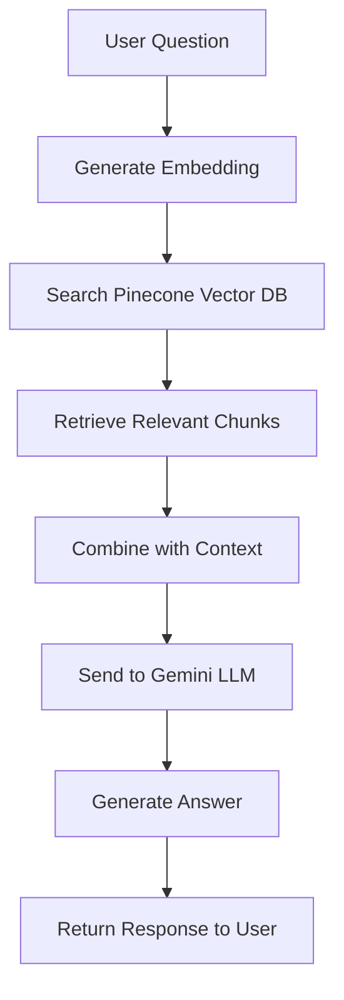

# 🏥 Medical Chatbot

An intelligent medical assistant powered by AI that provides accurate medical information using advanced retrieval-augmented generation (RAG) technology.

## ✨ Features

- 🤖 **Smart Q&A System**: Advanced RAG-based medical information retrieval
- 🔍 **Semantic Search**: Intelligent document search using vector embeddings
- 📄 **PDF Processing**: Automatic extraction and processing of medical documents
- 🌐 **Web Interface**: Clean, responsive chat interface
- ⚡ **Fast Retrieval**: Optimized vector database for quick responses
- 🎯 **Accurate Answers**: Context-aware responses based on medical literature

## 🛠️ Tech Stack

- **Backend**: Flask (Python web framework)
- **AI Framework**: LangChain (LLM orchestration)
- **Vector Database**: Pinecone (semantic search)
- **Embeddings**: Sentence Transformers (all-MiniLM-L6-v2)
- **Language Model**: Google Gemini 2.0 Flash
- **Frontend**: HTML/CSS with modern chat interface

## 📁 Project Structure

```
MedIQ-AI-main/
├── 📄 app.py                 # Main Flask application
├── 🔧 store_index.py         # Vector database setup script
├── 📚 data/                  # Medical PDF documents
│   └── Medical_book.pdf
├── 📦 src/
│   ├── helper.py             # PDF processing & embedding functions
│   └── prompt.py             # AI system prompts
├── 🎨 templates/
│   └── chat.html             # Chat interface template
├── 💅 static/
│   └── style.css             # Interface styling
├── 📋 requirements.txt       # Python dependencies
└── 📖 README.md              # This file
```

## 🚀 Quick Start

### Prerequisites

Before you begin, ensure you have:
- **Python 3.8+** installed
- **Git** for cloning the repository
- **API Keys** for Pinecone and Google Gemini

### Step 1: Clone the Repository

```bash
git clone https://github.com/yourusername/MedIQ-AI.git
cd MedIQ-AI
```

### Step 2: Install Dependencies

```bash
# Create a virtual environment (recommended)
python -m venv venv

# Activate virtual environment
# On Windows:
venv\Scripts\activate
# On macOS/Linux:
source venv/bin/activate

# Install required packages
pip install -r requirements.txt
```

### Step 3: Set Up Environment Variables

Create a `.env` file in the project root:

```env
# Required API Keys
PINECONE_API_KEY=your_pinecone_api_key_here
GOOGLE_API_KEY=your_google_gemini_api_key_here

# Optional (if using OpenAI)
OPENAI_API_KEY=your_openai_api_key_here
```

**🔑 How to get API keys:**
- **Pinecone**: Sign up at [pinecone.io](https://pinecone.io) → Get API key from dashboard
- **Google Gemini**: Get API key from [Google AI Studio](https://makersuite.google.com/app/apikey)

### Step 4: Build the Vector Database

```bash
python store_index.py
```

This script will:
- ✅ Load PDF documents from the `data/` folder
- ✅ Split text into manageable chunks (500 characters each)
- ✅ Generate vector embeddings using Sentence Transformers
- ✅ Create and populate Pinecone index
- ✅ Store vectors for fast semantic search

### Step 5: Run the Application

```bash
python app.py
```

The application will start on `http://localhost:8080`

**🎉 Success!** Open your browser and start chatting with your medical assistant!

## 🔧 How It Works



1. **📄 Document Processing**: PDFs are loaded and split into 500-character chunks
2. **🧠 Embedding Generation**: Text chunks are converted to 384-dimensional vectors
3. **💾 Vector Storage**: Embeddings are stored in Pinecone for lightning-fast retrieval
4. **🔍 Query Processing**: User questions are embedded and similar chunks are retrieved
5. **🤖 Answer Generation**: Retrieved context is passed to Gemini to generate accurate responses

## 🌐 API Endpoints

| Method | Endpoint | Description |
|--------|----------|-------------|
| `GET` | `/` | Serves the chat interface |
| `POST` | `/get` | Processes chat messages and returns AI responses |

## ⚙️ Configuration

| Setting | Value | Location | Description |
|---------|-------|----------|-------------|
| Chunk Size | 500 characters | `src/helper.py` | Size of text chunks for processing |
| Retrieval Count | 3 chunks | `app.py` | Number of relevant chunks to retrieve |
| Embedding Model | all-MiniLM-L6-v2 | `src/helper.py` | Sentence transformer model |
| Vector Dimension | 384 | `store_index.py` | Embedding vector size |
| Port | 8080 | `app.py` | Default application port |

## 🐛 Troubleshooting

### Common Issues

**❌ "Module not found" error:**
```bash
# Make sure you're in the virtual environment
source venv/bin/activate  # macOS/Linux
# or
venv\Scripts\activate     # Windows

# Reinstall dependencies
pip install -r requirements.txt
```

**❌ "Pinecone API key not found":**
- Check your `.env` file exists in the project root
- Verify the API key is correct and active
- Ensure no extra spaces in the `.env` file

**❌ "Index not found" error:**
```bash
# Rebuild the vector database
python store_index.py
```

**❌ "Port already in use":**
```bash
# Kill process using port 8080
lsof -ti:8080 | xargs kill -9  # macOS/Linux
# or change port in app.py
```

### Getting Help

- 📧 Check the logs in your terminal for detailed error messages
- 🔍 Ensure all API keys are valid and have proper permissions
- 📚 Review the [LangChain documentation](https://python.langchain.com/) for framework-specific issues

## 🚀 Development

### Running in Development Mode

```bash
# Enable debug mode (auto-reload on changes)
export FLASK_DEBUG=1  # macOS/Linux
set FLASK_DEBUG=1     # Windows
python app.py
```

### Adding New Medical Documents

1. Place PDF files in the `data/` folder
2. Run `python store_index.py` to rebuild the vector database
3. Restart the application

## 👨‍💻 Author

**Ayush Singh** - Software Engineer at Bobble AI
- 🐙 GitHub: [@AyushSingh](https://github.com/TecHAyusH6476/)


**⚠️ Disclaimer**: This chatbot is for educational purposes only. Always consult with qualified medical professionals for medical advice and diagnosis.